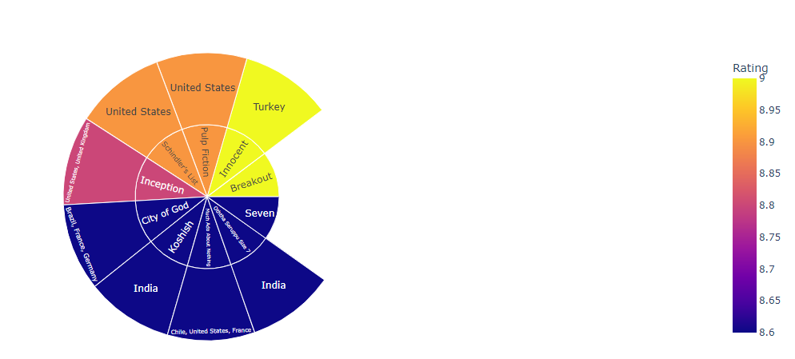

# Netflix_Recommedator
Xmas is approaching, have you got your Netflix movie marathon playlist ready?

If you have not got a chance to do so, I hope our project is a Merry Xmas gift to you!

Our project aims to build a movie recommendation mechanism within Netflix. The dataset we used here come directly from Netflix. It consists of 4 text data files, each file contains over 20M rows, i.e. over 4K movies and 400K customers. All together over 17K movies and 500K+ customers with total over 100m ratings given!

Our object is to learn from these big dataset and recommend best TV shows and movies to users based on their own rating marks and viewing behaviour patterns:

We deployed Surprise Which is an open-source Python library that makes it easy for developers to build recommender systems with explicit rating data.

We train and cross-validate a model that performs SVD (singular value decomposition) in order to build a recommendation system in just a few lines of code. SVD is a popular matrix factorization algorithm that can be used for recommender systems.
Recommender systems that use matrix factorization generally follow a pattern where a matrix of ratings is factored into a product of matrices representing latent factors for the items (in this case movies) and the users:

Let's decode the SVD blackbox via Matrix Factorization example:

Netflix is an application that keeps growing bigger and faster with its popularity, shows and content. Apart from the above recomendation system we built, we also would like to invite you to get to know your favourite movie app better through its data along with  a wide range of different graphs and visuals.

## Which months are usually the hottest season for new release?

it looks like the first 2 months of the year are comparatively less competitive and Jan and Feb might be a good choice for the producer, while June, July, August will give you more choices as viewers.

## Analysing IMDB ratings to get top rated movies on Netflix:

Let data show who is the most popular French director:

Which countries have created the highest rated content?

What are the most popular Genres for Movies and TV Shows?

 

How much Covid slow down content release?

2017&2018 have lots of new release while 2020 &2021 release activity dropped significantly might due to pandemic lockdown etc.

We hope you had a fun journey with us exploring Netflix and our recommedation sytem can assist you sort out your holiday movie list.

Merry Christmas and Happy New Year!!!
